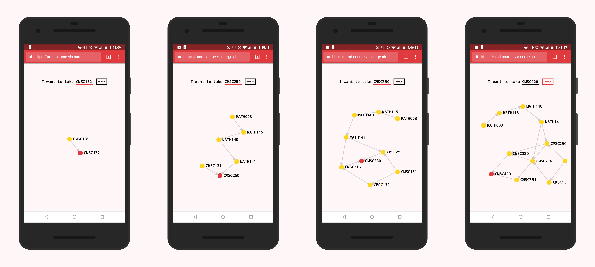

# umd-course-vis



Recursively visualize a graph of prerequisites for any course offered at UMD.

Examples: [CMSC132](https://umd-course-vis.surge.sh/#/CMSC132) | [CMSC250](https://umd-course-vis.surge.sh/#/CMSC250) | [CMSC330](https://umd-course-vis.surge.sh/#/CMSC330) | [CMSC420](https://umd-course-vis.surge.sh/#/CMSC420)

## How it works

We're using the https://umd.io API to get course information. The prerequisites are returned as a string like the below (for MATH403):

```
1 course with a minimum grade of C- from (MATH240, MATH461, MATH340); and 1 course with a minimum grade of C- from (MATH341, MATH241); and minimum grade of C- in MATH310.
```

We parse the prerequisites using regex and place the courses in the `from (....)` statements in an array since a student only has to pick one from each set of `from (....)` statements. For MATH403, the parsed prereqs object will look like the below:

```json
{
  "mustTake": ["MATH310"],
  "pickOneFromEach": [["MATH240", "MATH461", "MATH340"], ["MATH341", "MATH241"]]
}
```

...where `mustTake` consists of an array of all classes the student must take as a direct prerequisite. The `pickOneFromEach` is an array of arrays of classes. The student must take one class from each array (i.e. one class from each `from (....)` statement. So there are multiple ways to obtain all the prerequisites to MATH403. Each array is displayed as a set of links to it's own prerequisites. For an example, checkout the bottom of [https://umd-course-vis.surge.sh/#/MATH403](https://umd-course-vis.surge.sh/#/MATH403).

Then we repeat the above steps for each course in the prereq object, recursively getting all the prerequisites, and use the [vue-d3-network](https://github.com/emiliorizzo/vue-d3-network) library to render a graph of the prerequisites.

Here's the [parsePrereqs](./src/parsePrereqs.js) function and here's [the tests for it](./__tests__/parsePrereqs.test.js).

## Getting Started

1. Have Node.js and npm installed
2. Clone this repo
3. `cd` into this project's folder
4. `npm i` to install all dependencies
5. `npm run serve` and visit `http://localhost:8080` in your browser

## Built With

- [Vue.js](https://vuejs.org) for quicker front end development
- [umd.io](https://umd.io) to get course info
- [D3 Network](https://github.com/emiliorizzo/vue-d3-network) to create the graph
